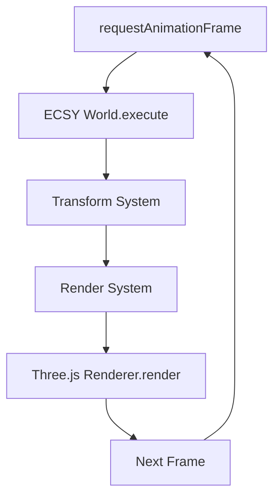

# Arquitetura 3D - ECSY + Three.js + Electron

## Visão Geral

Este documento descreve a arquitetura 3D do projeto DC-G, combinando ECSY (Entity-Component-System) com Three.js no ambiente Electron.

## Separação de Processos (Main vs. Renderer)

### Main Process (Node.js)
- **Responsabilidades**: Sistema operacional, janelas, arquivos, IPC
- **Não tem**: Acesso direto ao WebGL ou Three.js
- **Comunicação**: Apenas eventos de alto nível via IPC

### Renderer Process (Chromium)
- **Responsabilidades**: Renderização 3D, UI, loop do jogo
- **Three.js/ECSY**: Rodam inteiramente aqui
- **Canvas**: Elemento HTML para renderização WebGL

### Comunicação IPC
```typescript
// ✅ Correto - Eventos de alto nível
window.electronAPI.onWindowEvent(callback)
window.electronAPI.loadAsset(path)

// ❌ Incorreto - Dados pesados via IPC
// Não enviar geometrias ou texturas via IPC
```

## Estrutura do Loop ECSY + Three.js

### Fluxo Principal


### Sincronização ECSY ↔ Three.js
- **ECSY**: Gerencia estado (dados)
- **Three.js**: Gerencia visualização (objetos)
- **Sistemas**: Fazem a ponte entre os dois

### Componentes de Sincronização
```typescript
// ECSY Component
class Transform {
  position: Vector3
  rotation: Euler
  scale: Vector3
}

// Three.js Object
const mesh = new THREE.Mesh()

// Sistema de Sincronização
class TransformSystem {
  execute() {
    // Copia dados do ECSY para Three.js
    transform.applyToObject3D(mesh)
  }
}
```

## Gerenciamento de Assets (Arquivos Locais)

### Protocolos Customizados
```typescript
// No main process
protocol.registerBufferProtocol('app', (request, callback) => {
  const filePath = path.join(__dirname, request.url.slice(6))
  const data = fs.readFileSync(filePath)
  callback({ data })
})

// No renderer process
const loader = new THREE.GLTFLoader()
loader.load('app://assets/models/character.glb', ...)
```

### Lazy Loading
```typescript
class AssetManager {
  private loadedAssets = new Map()
  
  async loadModel(path: string) {
    if (this.loadedAssets.has(path)) {
      return this.loadedAssets.get(path)
    }
    
    const model = await this.loadFromFile(path)
    this.loadedAssets.set(path, model)
    return model
  }
}
```

## Performance e Ciclo de Vida

### RequestAnimationFrame
```typescript
class World {
  start() {
    const animate = () => {
      requestAnimationFrame(animate) // 60 FPS
      
      // Executa mundo ECSY
      this.ecsyWorld.execute(1/60)
      
      // Renderiza Three.js
      this.renderer.render(this.scene, this.camera)
    }
    animate()
  }
}
```

### Garbage Collection
```typescript
class EntityFactory {
  removeEntity(entity) {
    const object3D = entity.getComponent(Object3D)
    if (object3D) {
      const mesh = object3D.value as THREE.Mesh
      this.scene.remove(mesh)
      mesh.geometry.dispose()
      if (mesh.material instanceof THREE.Material) mesh.material.dispose()
    }
    entity.remove()
  }
}
```

### V-Sync
- Electron respeita refresh rate do monitor
- Sem tearing em aplicações 3D
- requestAnimationFrame sincronizado com display

## Estrutura de Diretórios 3D

```
src/3d/
├── World.ts              # Mundo principal (ECSY + Three.js)
├── components/           # Componentes ECSY
│   ├── Position.ts       # Posição 3D
│   ├── Rotation.ts       # Rotação 3D
│   ├── Scale.ts          # Escala 3D
│   ├── Object3D.ts       # Referência Three.js
│   └── Visible.ts        # Controle de visibilidade
├── systems/              # Sistemas ECSY
│   ├── TransformSystem.ts # Sincronização de transform
│   └── RenderSystem.ts   # Gerenciamento de renderização
├── utils/                # Utilitários
│   └── EntityFactory.ts  # Factory de entidades
└── assets/               # Assets 3D
    ├── models/           # Modelos 3D (.glb, .gltf)
    ├── textures/         # Texturas (.jpg, .png)
    └── materials/        # Materiais personalizados
```

## Padrões de Uso

### Criação de Entidades
```typescript
// Via EntityFactory
const cube = entityFactory.createCube({ x: 0, y: 0, z: 0 }, 1, 0x00ff00)
const sphere = entityFactory.createSphere({ x: 2, y: 0, z: 0 }, 0.5, 0xff0000)

// Manualmente
const entity = world.createEntity()
entity.addComponent(Position)
entity.addComponent(Rotation)
entity.addComponent(Scale)
entity.addComponent(Object3D)
entity.addComponent(Visible)
```

### Sistemas Personalizados
```typescript
class MovementSystem extends System {
  static queries = {
    movable: { components: [Position, Velocity] }
  }
  
  execute(delta) {
    this.queries.movable.results.forEach(entity => {
      const position = entity.getComponent(Position)
      const velocity = entity.getComponent(Velocity)
      position.value.add(velocity.value.clone().multiplyScalar(delta))
    })
  }
}
```

### Componentes Customizados
```typescript
class Velocity extends Component {
  static schema = {
    value: { type: Types.Ref, default: () => new Vector3() }
  }
  
  value!: Vector3
}
```

## Boas Práticas

### Performance
- **Object Pooling**: Reuse objetos em vez de criar/destruir
- **Frustum Culling**: Three.js já faz, mas mantenha entidades fora de vista desativadas
- **LOD**: Level of Detail para modelos complexos
- **Batching**: Agrupe geometrias similares

### Memória
- **Dispose**: Sempre limpe geometrias e materiais
- **Textures**: Carregue texturas apenas quando necessário
- **Audio**: Use Web Audio API para sons 3D

### Segurança
- **Context Isolation**: Mantenha habilitado
- **Node Integration**: Desabilite no renderer
- **Preload Script**: Único ponto de comunicação

## Debug e Ferramentas

### DevTools 3D
```typescript
// Habilita Three.js Inspector
if (process.env.NODE_ENV === 'development') {
  import('three/examples/jsm/exporters/GLTFExporter.js')
}
```

### ECSY Inspector
```typescript
// Debug de entidades
world.registerSystem(DebugSystem)
```

### Performance Monitor
```typescript
class PerformanceMonitor {
  update() {
    const stats = this.renderer.info
    console.log('Geometries:', stats.memory.geometries)
    console.log('Textures:', stats.memory.textures)
    console.log('Draw calls:', stats.render.calls)
  }
}
```

## Problemas Comuns

### Sincronização
- **Problema**: Transform não atualiza visualmente
- **Solução**: Verifique se o sistema está registrado e executando

### Performance
- **Problema**: FPS baixo com muitas entidades
- **Solução**: Implemente frustum culling e LOD

### Memória
- **Problema**: Leaks de memória GPU
- **Solução**: Sempre chame dispose() em geometrias/materiais

### Assets
- **Problema**: CORS ao carregar arquivos locais
- **Solução**: Use protocolos customizados do Electron

---

**Última atualização**: 2026-02-05  
**Versão**: 1.0.0  
**Revisão**: Próxima revisão em 2026-05-05  
**Mudanças**: Atualizada estrutura de componentes para Position, Rotation, Scale separados
