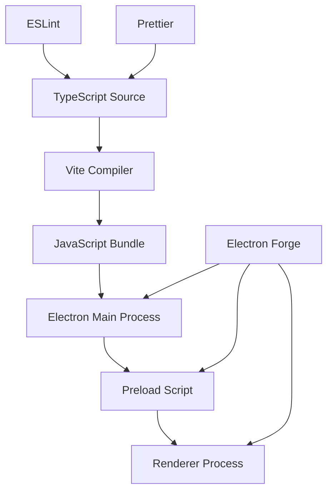

# Dependências e Responsabilidades

## Visão Geral

Este documento detalha as responsabilidades de cada dependência principal no projeto DC-G, explicando o papel de cada ferramenta no ecossistema da aplicação.

## Tabela de Responsabilidades

| Camada | Responsabilidade Principal | Ferramenta | Versão |
|--------|---------------------------|-------------|---------|
| **Runtime** | Gerenciamento de processos, janelas nativas, sistema operacional | Electron | 40.1.0 |
| **Build Tool** | Compilação TypeScript, hot reload, otimização de bundles | Vite | 5.4.21 |
| **Bundler** | Empacotamento, distribuição, configurações de build | Electron Forge | 7.11.1 |
| **Linguagem** | Type safety, interfaces, enums, decorators | TypeScript | 4.5.4 |
| **3D Engine** | Renderização 3D, geometrias, materiais, câmeras, luzes | Three.js | 0.169.0 |
| **ECS Framework** | Arquitetura Entity-Component-System, gestão de estado | ECSY | 0.4.2 |
| **Linting** | Qualidade de código, padrões, formatação | ESLint | 8.57.1 |
| **Formatação** | Estilo de código, consistência visual | Prettier | - |
| **Segurança** | Isolamento de contexto, comunicação segura | contextBridge | - |

## Detalhamento das Dependências

### 🖥️ Electron (Runtime Principal)

**Responsabilidades:**
- **Gerenciamento de Processos**: Main process, renderer process, preload scripts
- **Janelas Nativas**: Criação, gerenciamento, menus, diálogos
- **Acesso ao Sistema**: File system, system APIs, notificações
- **Ciclo de Vida**: App events, window events, process lifecycle
- **Segurança**: Context isolation, node integration control

**Arquivos Relacionados:**
- `src/main.ts` - Processo principal
- `src/preload.ts` - Script de preload
- `forge.config.ts` - Configuração do Electron

**APIs Principais:**
```typescript
import { app, BrowserWindow, ipcMain } from 'electron'
```

### ⚡ Vite (Build Tool)

**Responsabilidades:**
- **Compilação TypeScript**: Transpilação para JavaScript
- **Hot Reload**: Recarregamento automático em desenvolvimento
- **Bundle Optimization**: Code splitting, tree shaking
- **Dev Server**: Servidor de desenvolvimento rápido
- **Asset Management**: Processamento de CSS, imagens, fonts

**Configurações Múltiplas:**
- `vite.main.config.ts` - Build do processo main
- `vite.preload.config.ts` - Build do preload
- `vite.renderer.config.ts` - Build do renderer

**Vantagens:**
- Build extremamente rápido
- HMR (Hot Module Replacement)
- Configuração simplificada
- Suporte nativo a TypeScript

### 📦 Electron Forge (Bundler)

**Responsabilidades:**
- **Empacotamento**: Criar executáveis para diferentes plataformas
- **Distribuição**: Gerar instaladores, updates
- **Plugins**: Extensões para diferentes funcionalidades
- **Makers**: Gerar builds específicos (ZIP, MSI, DEB, RPM)
- **Fuses**: Configurações de segurança avançadas

**Makers Configurados:**
- `@electron-forge/maker-squirrel` - Windows
- `@electron-forge/maker-deb` - Linux Debian
- `@electron-forge/maker-rpm` - Linux RPM
- `@electron-forge/maker-zip` - Universal

**Scripts Disponíveis:**
```json
{
  "start": "electron-forge start",
  "package": "electron-forge package", 
  "make": "electron-forge make",
  "publish": "electron-forge publish"
}
```

### 📘 TypeScript (Linguagem)

**Responsabilidades:**
- **Type Safety**: Verificação de tipos em tempo de compilação
- **Interfaces**: Contratos de dados e APIs
- **Enums**: Conjuntos de valores constantes
- **Generics**: Código reutilizável type-safe
- **Decorators**: Metadados e configurações (futuro)

**Configuração (`tsconfig.json`):**
- Target: ES2020
- Module: ESNext
- Strict mode habilitado
- Suporte a decorators

**Benefícios:**
- Autocompletar melhor
- Refatoração segura
- Documentação via tipos
- Detecção precoce de erros

### 🎨 Three.js (3D Engine)

**Responsabilidades:**
- **Renderização 3D**: WebGL, canvas, render pipeline
- **Geometrias**: Meshes, primitivas, modelos 3D
- **Materiais**: Texturas, shaders, iluminação
- **Câmeras**: Perspectiva, ortográfica, controles
- **Luzes**: Ambient, directional, point, spot
- **Animações**: Keyframes, morph targets, bones
- **Performance**: Frustum culling, LOD, batching

**Arquivos Relacionados:**
- `src/3d/World.ts` - Cena principal e renderer
- `src/3d/components/Object3D.ts` - Componente de objeto Three.js
- `src/3d/systems/RenderSystem.ts` - Sistema de renderização

**APIs Principais:**
```typescript
import * as THREE from 'three'
import { Scene, Camera, Renderer, Mesh, Geometry, Material } from 'three'
```

**Integração com Electron:**
- Roda no renderer process (contexto do navegador)
- Usa canvas HTML para renderização
- Acesso via requestAnimationFrame para loop principal

### 🧩 ECSY (ECS Framework)

**Responsabilidades:**
- **Arquitetura ECS**: Entidades, Componentes, Sistemas
- **Gestão de Estado**: Component-based data
- **Sistemas**: Lógica de negócio e atualizações
- **Queries**: Seleção eficiente de entidades
- **Performance**: Cache-friendly, data-oriented

**Arquivos Relacionados:**
- `src/3d/World.ts` - Mundo ECSY + Three.js
- `src/3d/components/` - Componentes ECSY
- `src/3d/systems/` - Sistemas ECSY
- `src/3d/utils/EntityFactory.ts` - Factory de entidades

**APIs Principais:**
```typescript
import { World, Entity, Component, System } from 'ecsy'
```

**Padrão de Uso:**
- **Entidades**: Objetos do jogo (jogador, inimigos, itens)
- **Componentes**: Dados (Transform, Visible, Object3D)
- **Sistemas**: Lógica (TransformSystem, RenderSystem)

### 🔍 ESLint (Qualidade de Código)

**Responsabilidades:**
- **Análise Estática**: Detectar problemas de código
- **Padrões**: Forçar boas práticas
- **Consistência**: Manter estilo uniforme
- **Integração**: Funciona com Prettier sem conflitos

**Configuração (`.eslintrc.json`):**
```json
{
  "extends": [
    "eslint:recommended",
    "@typescript-eslint/recommended", 
    "plugin:import/recommended",
    "prettier"
  ]
}
```

**Regras Principais:**
- TypeScript strict mode
- Import/export organizados
- Sem variáveis não usadas
- Padrões de código modernos

### 🎨 Prettier (Formatação)

**Responsabilidades:**
- **Formatação Automática**: Estilo de código consistente
- **Configuração Centralizada**: Regras via `.prettierrc`
- **Integração**: Funciona com ESLint sem conflitos
- **Formatação**: Ponto e vírgula, aspas, indentação

**Configuração (`.prettierrc`):**
```json
{
  "semi": false,
  "singleQuote": true,
  "printWidth": 150,
  "trailingComma": "none"
}
```

**Integração com ESLint:**
- `eslint-config-prettier` desabilita regras conflitantes
- Formatação e linting trabalham juntos

### 🔒 Context Bridge (Segurança)

**Responsabilidades:**
- **Isolamento Seguro**: Comunicação entre processos
- **API Exposição**: Interface controlada para renderer
- **Validação**: Filtro de dados entre processos
- **Segurança**: Previne acesso não autorizado

**Implementação:**
```typescript
// No preload.ts
contextBridge.exposeInMainWorld('electronAPI', {
  readFile: (path: string) => ipcRenderer.invoke('read-file', path),
  platform: process.platform
})
```

## Fluxo de Dados e Responsabilidades



## Ecossistema de Desenvolvimento

### Camada de Desenvolvimento
1. **Escrita**: TypeScript com ESLint + Prettier
2. **Build**: Vite compila e otimiza
3. **Runtime**: Electron executa os processos
4. **Empacotamento**: Forge cria distribuíveis

### Camada de Produção
1. **Segurança**: Context bridge isola processos
2. **Performance**: Vite otimiza bundles
3. **Distribuição**: Forge gera executáveis
4. **Manutenção**: TypeScript facilita refatoração

## Boas Práticas

### Uso das Dependências
- **Electron**: Apenas para APIs nativas e sistema
- **Vite**: Configurações específicas por processo
- **TypeScript**: Tipos fortes em todo o projeto
- **ESLint**: Configuração consistente na equipe
- **Prettier**: Formatação automática ao salvar

### Performance
- **Vite**: Aproveite HMR em desenvolvimento
- **TypeScript**: Compile apenas arquivos modificados
- **Electron**: Lazy loading de módulos pesados

### Segurança
- **Context Bridge**: Nunca exponha APIs sensíveis
- **TypeScript**: Use tipos para validação
- **ESLint**: Previna padrões inseguros

## Atualizações e Manutenção

### Versões Atuais
- **Electron**: 40.1.0 (última estável)
- **Vite**: 5.4.21 (compatível com Electron)
- **TypeScript**: 4.5.4 (estável para Electron)
- **ESLint**: 8.57.1 (compatível com TypeScript)

### Política de Atualização
- **Electron**: Atualizar a cada 2-3 meses
- **Vite**: Atualizações menores semanais
- **TypeScript**: Versões LTS quando disponíveis
- **ESLint**: Manter compatibilidade com TypeScript

## Problemas Comuns

### Conflitos
- **ESLint vs Prettier**: Resolvido com `eslint-config-prettier`
- **Vite vs Electron**: Configurações separadas por processo
- **TypeScript vs Vite**: Configuração sincronizada

### Performance
- **Build lento**: Verifique configurações do Vite
- **Runtime lento**: Otimize código do main process
- **Memória**: Monitore uso de memória do Electron

---

**Última atualização**: 2026-02-05  
**Versão**: 1.0.0  
**Revisão**: Próxima revisão em 2026-05-05
