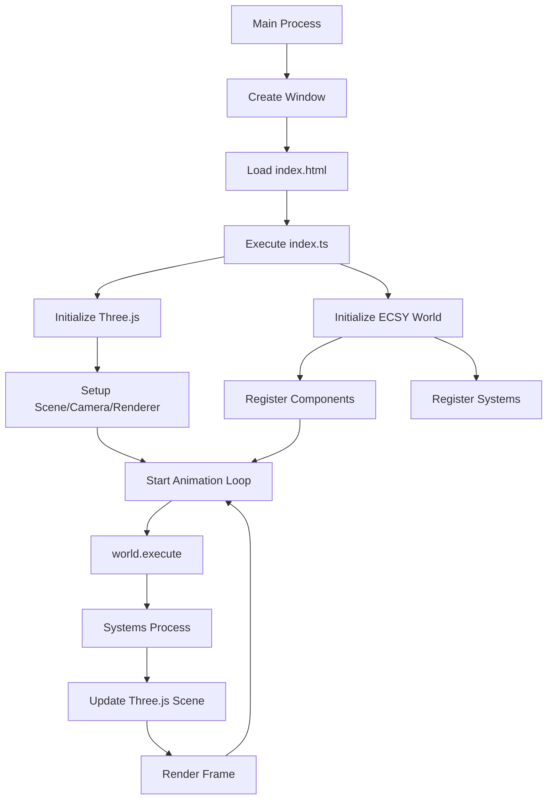

# Estrutura de Diretórios do Projeto

## Visão Geral

Uma estrutura bem organizada é vital para não misturar a lógica de "baixo nível" do Electron com a complexidade do motor de jogo/aplicação em 3D. Esta documentação descreve a estrutura ideal para o projeto DC-G, seguindo as melhores práticas para aplicações Electron com ECSY + Three.js.

## Estrutura de Pastas Sugerida

```
dc-g/
├── src/
│   ├── main/                     # Processo Principal (Node.js)
│   │   └── main.ts              # Entrada do Electron (janelas, menus)
│   ├── renderer/                 # Processo de Renderização (Onde a mágica acontece)
│   │   ├── index.html           # Ponto de entrada HTML
│   │   ├── index.ts             # Inicializa o app e o loop do ECSY
│   │   ├── index.css            # Estilos globais
│   │   ├── core/                # Engine e configuração do ECSY
│   │   │   ├── world.ts         # Instância do ECSY World
│   │   │   └── engine.ts        # Setup do Three.js (Scene, Renderer, Camera)
│   │   ├── components/          # Componentes do ECSY (Dados puros)
│   │   │   ├── Transform.ts
│   │   │   ├── MeshTag.ts
│   │   │   ├── Position.ts
│   │   │   ├── Rotation.ts
│   │   │   ├── Scale.ts
│   │   │   └── Visible.ts
│   │   ├── systems/             # Sistemas do ECSY (Lógica)
│   │   │   ├── MovementSystem.ts
│   │   │   ├── RenderSystem.ts  # Sincroniza ECSY -> Three.js
│   │   │   └── TransformSystem.ts
│   │   └── assets/              # Modelos 3D, Texturas, Shaders
│   │       ├── models/
│   │       ├── textures/
│   │       └── shaders/
│   ├── preload/                 # Script de ponte (Segurança IPC)
│   │   └── preload.ts
│   └── shared/                  # Código compartilhado entre processos
│       ├── types/               # Tipos TypeScript compartilhados
│       └── constants/           # Constantes globais
├── assets/                      # Ícones do app e recursos estáticos
│   ├── icons/
│   └── images/
├── docs/                        # Documentação detalhada
├── .vite/                       # Build artifacts
├── dist/                        # Build final
├── package.json
├── tsconfig.json
├── vite.main.config.ts
├── vite.preload.config.ts
├── vite.renderer.config.ts
└── forge.config.ts
```

## O Papel de Cada Pasta

### 1. `src/main/` - Processo Principal
**Responsabilidade**: Gerenciar janelas, menus, integração com sistema operacional e ciclo de vida da aplicação.

- **main.ts**: Ponto de entrada do Electron
  - Criação e gerenciamento de BrowserWindows
  - Configuração de menus e atalhos
  - Handlers de eventos do ciclo de vida
  - Comunicação IPC com o renderer

**Regras**:
- Nunca acessar diretamente o DOM
- Mínima lógica de negócio possível
- Focar em infraestrutura Electron

### 2. `src/renderer/` - Processo de Renderização
**Responsabilidade**: Onde toda a mágica 3D acontece - ECSY, Three.js, UI e lógica do jogo.

#### `src/renderer/core/`
Isolamento da configuração pesada da engine 3D.

- **engine.ts**: Configuração do Three.js
  ```typescript
  // Deve conter:
  - Cena (Scene)
  - Renderer (WebGLRenderer)
  - Câmera (PerspectiveCamera)
  - Luzes básicas
  - Controles (OrbitControls, etc.)
  ```

- **world.ts**: Configuração do ECSY
  ```typescript
  // Deve conter:
  - Instância do ECSY World
  - Registro de todos os componentes
  - Registro de todos os sistemas
  - Configuração do loop principal
  ```

#### `src/renderer/components/`
Seguindo a filosofia do ECS, aqui você define apenas a forma dos dados.

**Regras**:
- Componentes são apenas estruturas de dados
- Sem lógica de processamento
- Tipos TypeScript fortemente tipados
- Serializáveis quando possível

**Exemplos**:
```typescript
// Transform.ts - Apenas dados, sem lógica
export class Transform {
  position: { x: number; y: number; z: number } = { x: 0, y: 0, z: 0 }
  rotation: { x: number; y: number; z: number } = { x: 0, y: 0, z: 0 }
  scale: { x: number; y: number; z: number } = { x: 1, y: 1, z: 1 }
}
```

#### `src/renderer/systems/`
É aqui que a lógica vive. Os sistemas consultam quais entidades têm determinados componentes e executam ações.

**Sistemas Principais**:

- **RenderSystem**: Sistema mais importante na integração
  ```typescript
  // Percore entidades com Transform + Object3D
  // Atualiza posição/rotação/escala dos meshes Three.js
  // Sincroniza estado ECSY -> Three.js a cada frame
  ```

- **MovementSystem**: Lógica de movimento
  ```typescript
  // Aplica velocidade, aceleração
  - Física básica
  - Detecção de colisões
  - Animações de transformação
  ```

- **InputSystem**: Processamento de input
  ```typescript
  // Mouse, teclado, gamepad
  - Mapeamento de ações
  - Eventos de UI
  ```

#### `src/renderer/assets/`
No Electron, você pode carregar arquivos locais usando caminhos relativos.

**Estrutura**:
```
assets/
├── models/      # .glb, .obj, .fbx
├── textures/    # .jpg, .png, .hdr
├── shaders/     # .glsl, .wgsl
└── audio/       # .mp3, .wav, .ogg
```

**Loading Strategy**:
```typescript
// Usar import dinâmico para assets
const model = await import('../assets/models/character.glb')
// Ou fetch para arquivos locais
const texture = await fetch('/assets/textures/diffuse.jpg')
```

### 3. `src/preload/` - Script de Ponte
**Responsabilidade**: Segurança entre processos Main e Renderer.

- **preload.ts**: Expõe APIs seguras para o renderer
  - Wrapper de APIs Node.js
  - Validação de dados IPC
  - Sanitização de caminhos de arquivo

### 4. `src/shared/` - Código Compartilhado
**Responsabilidade**: Tipos e constantes usados por múltiplos processos.

- **types/**: Interfaces TypeScript compartilhadas
- **constants/**: Valores globais da aplicação

## Fluxo de Dados Ideal

O fluxo ideal para o seu projeto será:

1. **Main Process** inicia a janela
2. **Renderer Process** carrega o `index.ts`
3. **index.ts** inicializa o Three.js e o ECSY World
4. **Loop de animação** (`requestAnimationFrame`) chama o `world.execute()`
5. **Systems** processam a lógica e atualizam a cena 3D



## Padrões de Comunicação

### IPC (Inter-Process Communication)
```typescript
// main.ts
ipcMain.handle('save-file', async (event, data) => {
  // Lógica de salvar arquivo
  return { success: true }
})

// preload.ts
contextBridge.exposeInMainWorld('electronAPI', {
  saveFile: (data) => ipcRenderer.invoke('save-file', data)
})

// renderer.ts
await window.electronAPI.saveFile(myData)
```

### Eventos Internos do Renderer
```typescript
// Sistema de eventos customizado para comunicação entre sistemas
class EventBus {
  private events = new Map<string, Function[]>()
  
  on(event: string, callback: Function) { /* ... */ }
  emit(event: string, data: any) { /* ... */ }
}
```

## Boas Práticas de Organização

### 1. Separação de Responsabilidades
- **Main**: Infraestrutura Electron
- **Renderer**: Lógica do jogo e UI
- **Core**: Configuração pesada (Three.js + ECSY)
- **Components**: Dados puros
- **Systems**: Lógica de processamento

### 2. Nomenclatura
- **Arquivos**: PascalCase para classes, camelCase para utilitários
- **Pastas**: Singular para tipos (component, system), plural para coleções (assets, models)
- **Exportações**: Named exports por padrão, default apenas para pontos de entrada

### 3. Imports
```typescript
// ✅ Bom - específico
import { Transform } from '../components/Transform'
import { RenderSystem } from '../systems/RenderSystem'

// ❌ Ruim - barrel files com side effects
import * from '../core'
```

### 4. Configuração
```typescript
// core/config.ts - Configurações centralizadas
export const RENDER_CONFIG = {
  antialias: true,
  pixelRatio: window.devicePixelRatio,
  shadowMap: true
} as const
```

## Migração da Estrutura Atual

### Estado Atual vs Desejado

| Atual | Desejado | Ação |
|-------|----------|------|
| `src/main.ts` | `src/main/main.ts` | Mover |
| `src/preload.ts` | `src/preload/preload.ts` | Mover |
| `src/renderer.ts` | `src/renderer/index.ts` | Mover + Expandir |
| `src/index.css` | `src/renderer/index.css` | Mover |
| `src/3d/World.ts` | `src/renderer/core/world.ts` | Mover + Refatorar |
| `src/3d/components/*` | `src/renderer/components/*` | Mover |
| `src/3d/systems/*` | `src/renderer/systems/*` | Mover |
| `src/3d/assets/` | `src/renderer/assets/` | Mover |

### Passos da Migração

1. **Criar estrutura de pastas**
2. **Mover arquivos existentes**
3. **Atualizar imports relativos**
4. **Criar arquivos de configuração**
5. **Atualizar Vite configs**
6. **Testar funcionamento**

## Configurações de Build

### Vite Configs
```typescript
// vite.main.config.ts
export default {
  build: {
    lib: {
      entry: 'src/main/main.ts',
      formats: ['cjs']
    }
  }
}

// vite.renderer.config.ts  
export default {
  build: {
    lib: {
      entry: 'src/renderer/index.ts',
      formats: ['es']
    }
  },
  resolve: {
    alias: {
      '@': path.resolve(__dirname, 'src/renderer'),
      '@core': path.resolve(__dirname, 'src/renderer/core'),
      '@components': path.resolve(__dirname, 'src/renderer/components'),
      '@systems': path.resolve(__dirname, 'src/renderer/systems')
    }
  }
}
```

## Considerações de Performance

### 1. Lazy Loading
```typescript
// Carregar assets sob demanda
const loadModel = async (path: string) => {
  const { GLTFLoader } = await import('three/examples/jsm/loaders/GLTFLoader')
  // ... loading logic
}
```

### 2. Code Splitting
```typescript
// Separar sistemas pesados em chunks
const PhysicsSystem = await import('./systems/PhysicsSystem')
```

### 3. Memory Management
```typescript
// Limpeza adequada de recursos
class World {
  dispose() {
    this.renderer.dispose()
    this.ecsyWorld.stop() // Se disponível
    // Limpar geometrias, texturas, materiais
  }
}
```

## Conclusão

Esta estrutura proporciona:
- **Separação clara** entre responsabilidades
- **Escalabilidade** para projetos maiores
- **Manutenibilidade** com código organizado
- **Performance** com lazy loading e code splitting
- **Segurança** com comunicação IPC adequada

Seguir esta estrutura desde o início evitará dores de cabeça futuras e facilitará a colaboração em equipe.

---

**Atualizado**: 2026-02-05  
**Versão**: 1.0.0  
**Autor**: dmont
